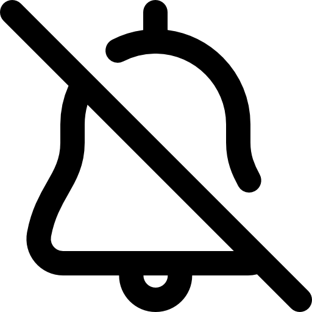

  
  
  # Notification Bell Hider for YouTube™

  **Get a cleaner, distraction-free experience on YouTube.**
  
  
  
  
  

 

## 🎯 About the Project

**Notification Bell Hider for YouTube™** is a minimalist and efficient Google Chrome extension that removes the notification bell from YouTube. Ideal for students, professionals, and anyone who wants to avoid distractions and maintain focus while consuming content on the platform.

With over **200 active users**, a perfect **5.0-star rating**, and the **Featured** badge from the Chrome Web Store, this extension does exactly what it promises: cleans up your interface quickly and silently.

---

## ✨ Features

- 🔕 **Automatic Removal:** Instantly hides the YouTube notification bell.
- ⚡ **Super Lightweight:** Zero impact on browser performance, running seamlessly in the background.
- 🔒 **Privacy First:** Does not collect any user data, requires no intrusive permissions (only access to youtube.com), and contains no ads.
- 🛠️ **Zero Configuration:** Install and you're done! There are no complex menus; the extension starts working immediately.

---

## 📥 How to Install

### Via Chrome Web Store (Recommended)
The easiest and safest way to install is directly through the official Chrome store:

1. Visit the [extension's page on the Chrome Web Store](https://chromewebstore.google.com/detail/notification-bell-hider-f/gcmneapbfclfaglkgbjhpaldldbninoe).
2. Click the **"Add to Chrome"** button.
3. Confirm the installation.
4. Open YouTube and enjoy an interface without the notification bell!

### Manual Installation (For Developers)
If you wish to inspect the code or test it locally:

1. Clone or download this repository.
2. Open Google Chrome and go to `chrome://extensions/`.
3. Enable **"Developer mode"** in the top right corner.
4. Click on **"Load unpacked"** and select this project's folder.

---

## 👨‍💻 How It Works

The extension uses a pure, extremely lightweight JavaScript `content_script` that monitors the YouTube page and removes the `<ytd-notification-topbar-button-renderer>` element from the DOM as soon as it loads. This ensures you never see the bell, helping you avoid FOMO (Fear Of Missing Out) and distractions.

---

## 🌟 Ratings and Feedback

Your opinion is very important! If you like the extension, please consider leaving a **5-star rating** on the [Chrome Web Store](https://chromewebstore.google.com/detail/notification-bell-hider-f/gcmneapbfclfaglkgbjhpaldldbninoe). This helps the project reach more people looking for focus and productivity.

---

  Made with ❤️ for a distraction-free web.

